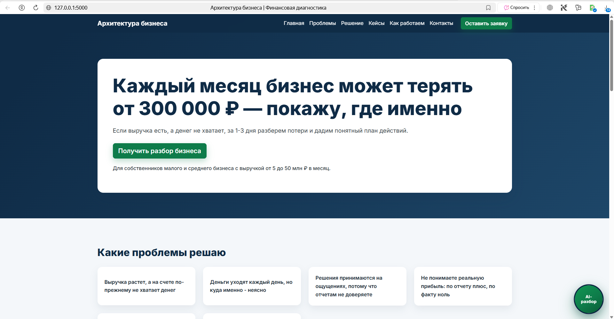
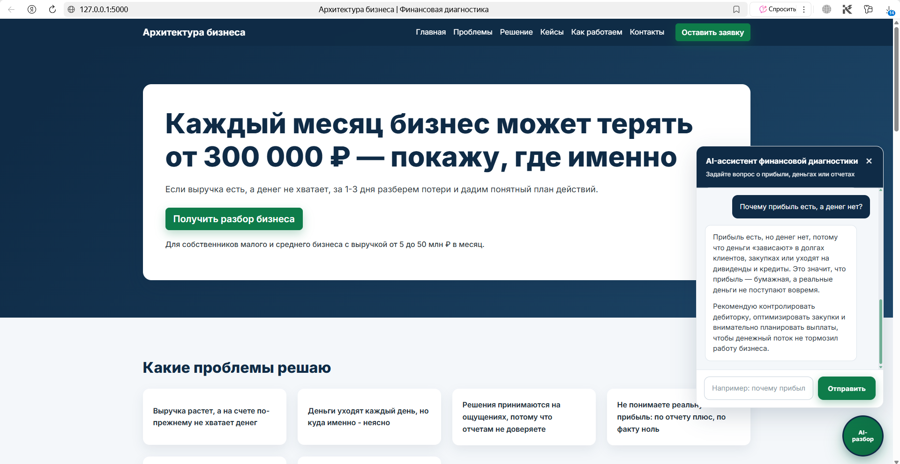
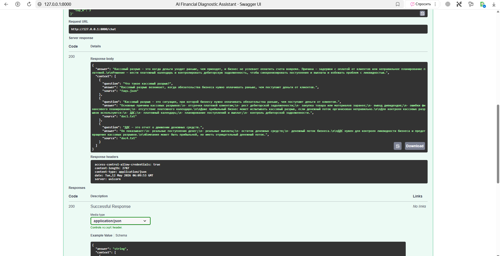
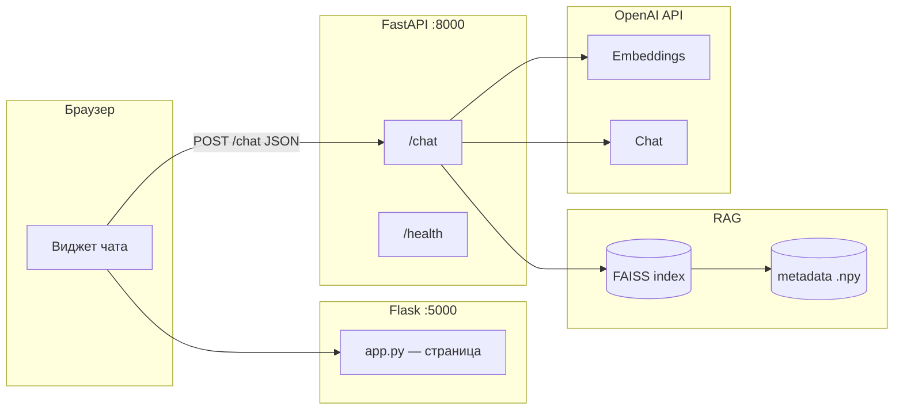

# AI Financial Diagnostic Assistant

Веб-приложение для **финансовой диагностики бизнеса**: краткие ответы собственнику о прибыли, расходах и денежных потоках на основе **RAG** (база знаний + **FAISS**) и **OpenAI**.

Ассистент получает вопрос пользователя, находит релевантные фрагменты из подготовленной базы (`data/`), передаёт их модели и формулирует ответ простым управленческим языком.

---
## Скриншоты проекта

### Главная страница



### AI-чат на сайте



### Swagger API



---

## Стек технологий

| Слой | Технологии |
|------|------------|
| Frontend | HTML, CSS, JavaScript; серверный рендер через **Flask** (`templates/`, `static/`) |
| API | **FastAPI**, **Uvicorn**, **Pydantic** |
| RAG | **OpenAI** embeddings (`text-embedding-3-small`), векторный поиск **FAISS** (`faiss-cpu`) |
| LLM | **OpenAI** Chat Completions (`gpt-4.1-mini`) |
| Данные | JSON FAQ (`faqs.json`), дополнительно `.txt` в `data/` при сборке индекса |
| Утилиты | **python-dotenv**, **NumPy** |

---

## Архитектура



1. Пользователь открывает сайт на **Flask** (порт 5000).
2. Виджет чата отправляет запросы на **FastAPI** (порт 8000): эмбеддинг вопроса → поиск соседей в FAISS → сборка промпта с контекстом → ответ модели.
3. Данные для индекса задаются в `data/faqs.json` и/или `.txt` в `data/`; скрипт `backend/build_index.py` пересчитывает индекс и метаданные.

---

## Структура проекта

```
.
├── app.py                 # Flask: главная страница с чатом
├── requirements.txt
├── README.md
├── templates/
│   └── index.html         # Разметка страницы и виджета
├── static/
│   ├── css/style.css
│   └── js/chat.js         # Логика чата, вызов FastAPI
├── backend/
│   ├── app.py             # FastAPI: /chat, /health, RAG + OpenAI
│   ├── build_index.py     # Построение FAISS из FAQ и .txt
│   └── rag_index.py       # Загрузка индекса и поиск
└── data/
    ├── faqs.json          # База вопрос–ответ (JSON-массив)
    ├── *.txt              # Опционально: документы для индекса
    ├── faiss_index.bin    # Генерируется build_index (можно пересобрать)
    └── faqs_metadata.npy  # Метаданные чанков для RAG
```

---

## Подготовка окружения

Требуется **Python 3.10+**.

1. Клонируйте репозиторий и перейдите в корень проекта.

2. Создайте виртуальное окружение и установите зависимости:

```bash
python -m venv .venv
.venv\Scripts\activate
pip install -r requirements.txt
```

3. В корне создайте файл `.env`:

```env
OPENAI_API_KEY=ваш_ключ_openai
```

Опционально для Flask, если FastAPI на другом хосте/порту:

```env
FASTAPI_URL=http://127.0.0.1:8000
```

---

## Построение RAG-индекса (FAISS)

Отредактируйте `data/faqs.json` и при необходимости добавьте `.txt` в `data/`. Затем:

```bash
python -m backend.build_index
```

Скрипт создаёт эмбеддинги для текстов «вопрос + ответ», строит **FAISS** `IndexFlatL2`, сохраняет `data/faiss_index.bin` и `data/faqs_metadata.npy`.

---

## Запуск Flask-сайта

В одном терминале (из корня проекта, с активированным venv):

```bash
python app.py
```

Сайт: **http://127.0.0.1:5000**

Альтернатива:

```bash
flask --app app run --debug --host 127.0.0.1 --port 5000
```

---

## Запуск FastAPI backend

Во втором терминале:

```bash
uvicorn backend.app:app --reload --host 0.0.0.0 --port 8000
```

Документация OpenAPI: **http://127.0.0.1:8000/docs**

CORS для фронта настроен на источники `http://127.0.0.1:5000` и `http://localhost:5000`.

---

## Примеры запросов

### Проверка API

```bash
curl http://127.0.0.1:8000/health
```

Ответ: `{"status":"ok"}`

### Чат (RAG)

```bash
curl -X POST http://127.0.0.1:8000/chat -H "Content-Type: application/json" -d "{\"message\": \"Почему прибыль есть, а денег нет?\", \"top_k\": 3}"
```

Пример тела ответа:

```json
{
  "answer": "Краткий ответ модели на русском...",
  "context": [
    {
      "question": "...",
      "answer": "...",
      "source": "faqs.json"
    }
  ]
}
```

---

## RAG и FAISS: как это устроено

- **Retrieval:** вопрос пользователя превращается в вектор тем же embedding-моделью, что и при индексации. В **FAISS** ищутся ближайшие по L2 дистанции документы из базы знаний.
- **Augmented generation:** найденные пары вопрос–ответ подставляются в промпт как контекст; **GPT** отвечает только в рамках этого контекста и заданных правил (краткость, управленческий стиль).
- **FAISS** здесь — лёгкий локальный индекс без отдельной БД: подходит для портфолио и демо; при росте данных имеет смысл смотреть в сторону persisted vector DB и шардирования.

---

## Портфолио

Этот репозиторий — **демонстрационный проект** для резюме и профиля разработчика: сквозной сценарий от данных и векторного поиска до API и пользовательского интерфейса. В описании работ или на собеседовании можно опереться на:

- проектирование **RAG-пайплайна** (данные → эмбеддинги → FAISS → LLM);
- разделение **Flask** (UI) и **FastAPI** (бизнес-логика и ИИ);
- аккуратную работу с **секретами** (`.env` не в git) и воспроизводимым окружением (`requirements.txt`).

Ссылка на репозиторий: [github.com/finnik82-75/ai-financial-diagnostic-assistant](https://github.com/finnik82-75/ai-financial-diagnostic-assistant)
